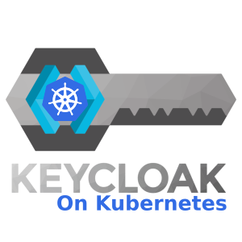

<p align="center">
	
</p>

# Keycloak on Kubernetes

## Description

Deploy [Keycloak](https://www.keycloak.org/) inside Kubernetes without the initial pain. 

This repository has the mission to be used as a reference to learn how to deploy Keycloak inside Kubernetes, with 
High Availability and sane values for configuration parameters, to avoid all the initial pain suffered by the lack of 
updated documentation about launching Keycloak on production environments.

## Diagram

This system is in charge of the security of other systems, so it lives alone, with a lot of care, but alone. The following
diagram only shows how it interacts with other kind of services.

```text
                       ┌───────────────────────────────────────────────────┐
                       │                                                   │
                       │                                                   │
                       │     ┌┬────────────┬┐          ┌┬──────────┬┐      │
                       │     ││ PostgreSQL │◄──────────►│ Keycloak ││      │
                       │     └┴────────────┴┘          └┴──────────┴┘      │
                       │                                                   │
                       │                                                   │
                       └───────▲────────────▲───────────▲─────────▲─Keycloak
                               │            │           │         │
                               │            │           │         │
                               │            │           │         │
                               │            │           │         │
                               │        ┌───▼───┐       │       ┌─▼─────┐
                               │        │ Vault │       │       │ . . . │
                               │        └───────┘       │       └───────┘
                          ┌────▼───┐               ┌────▼────┐
                          │  APIs  │               │   GUI   │
                          └────────┘               └─────────┘
```

You may be interested in a detailed insight about the system and how interacts with other system. Of course, if you
are that crazy, you can launch the full documentation following [these steps](README.md#full-documentation)
and see the full diagrams inside the section `Security Model`

## Motivation

There are two scenarios where this has been needed:

1. The companies commonly handle several internal tools which need to be authenticated or authorized to allow entrance.
   such as a secrets vault or a pipelines' executor. Even when most them expose ways to access, these ways are heterogeneous
   and uncomfortable. For convenience, a way to reduce overhead for employees is enabling SSO (Single Sign On) on every
   tool that is capable to use it.

2. Companies products need different ways to authorize its usage: SDKs, APIs, etc; and usually craft
   a different authorization flow for each product due to some of them are bought, others are homemade, and developers
   need to code fast and reduce team interdependency. In some point everything typically become a mesh for everyone, 
   and it is needed to unify these flows for all the company, allowing each tool to be authorized in a different way, but
   using the same user pool (cough, cough!! do you remember Oauth?)

## Requirements

> Following requirements are already covered by other projects crafted by us to bootstrap Kubernetes:
>
> - [Tooling Stack](https://github.com/prosimcorp/tooling-stack)
> - [Monitoring Stack](https://github.com/prosimcorp/monitoring-stack)

To deploy this system inside Kubernetes, some requirements must be satisfied.

The requirements depend on the target environment you need to deploy to, for example, to deploy `production` manifests,
there are some extra dependencies that are not needed when deploying using `develop` ones. This repository is designed 
this way to give a better insight about differences between the purpose of each environment.

To make this section easy to understand, choose an environment and read the following list:

### Common

To communicate with the cluster:

- [kubectl](https://kubernetes.io/docs/tasks/tools/install-kubectl-linux/) `v1.23+`

To expose the system to external traffic (the system is exposed using an Ingress resource):

- [Ingress NGINX controller](https://kubernetes.github.io/ingress-nginx/)
- [Cert Manager](https://cert-manager.io/)
- [External DNS](https://github.com/kubernetes-sigs/external-dns)

### Required only on `production`

- **[Common](README.md#common) +**
- [External Secrets](https://external-secrets.io/)

> On production, we assume that the credentials come from a secrets vault, such as [Hashicorp Vault](https://www.vaultproject.io/) 
> or [AWS Secrets Manager](https://aws.amazon.com/es/secrets-manager/). You may need to change some paths or parameters 
> on `ExternalSecret` manifests to fit your needs. 
> 
> **⚠️We will remind you about this later. Don't go to far...**

## How to deploy

> **The deployment will be done assuming `develop` environment**. If you are trying to deploy this in production,
> some extra requirements must be satisfied, better explained on the [requirements section](README.md#requirements)

Deploying this project is easy, just follow the following commands from the root path of the repository:

### Deploy the namespaces where everything will live

> Namespaces are deployed apart due to some automation tools like FluxCD, delete the resources deleting directly the
> namespaces. So we would like to have the namespaces safe if some day the infrastructure cluster is automated again.

```console
kubectl apply -k ./deploy/dependencies/namespaces
```

### Deploy the database

First you have to deploy the operator used to deploy the database:

```console
kubectl apply -k ./deploy/dependencies/postgresql/postgres-operator
```

When the operator detects that the credentials are already created inside Kubernetes before deploying the database, it 
simply uses them instead of creating. This is important because if they are not present, are autogenerated.

Because of that, now it is the moment to choose between deploying `Secret` resources directly for development purposes, 
or deploying `ExternalSecret` resources on production environments:

<details open>
   <summary>Command for develop</summary>

   ```console
   kubectl apply -k ./deploy/dependencies/postgresql/crs/prepare/develop
   ```
</details>

<details>
<summary>Command for production</summary>

```console
kubectl apply -k ./deploy/dependencies/postgresql/crs/prepare/production
```

> **Remember**
> - For production, you must satisfy some [extra requirements](README.md#required-only-on-production)
> - The database credentials have to already exist on your vault into the same paths we use on 
>   [these manifests](deploy/dependencies/postgresql/crs/prepare/production/externalSecrets) 
</details>

Then you can deploy the database

```console
kubectl apply -k ./deploy/dependencies/postgresql/crs/cluster/develop
```

### Deploy Keycloak

For both environments, an `Ingress` resource is deployed, with a TLS certificate requested by Cert Manager. 
This repository assumes there are two `ClusterIssuer` resources present on the cluster: `letsencrypt-production` and 
`letsencrypt-staging`. If your issuers are different, modify the Ingress resources to fit your environment needs.

This is the easy part, there we go:

```console
kubectl apply -k ./deploy/resources/develop
```
<details>
<summary>Command for production</summary>

```console
kubectl apply -k ./deploy/resources/production
```

> **Remember (again)**
> - For production, you must satisfy some [extra requirements](README.md#required-only-on-production)
> - Some credentials have to already exist on your vault into the same paths we use on 
>   [these other manifests](deploy/resources/production/externalSecrets) 
</details>

> When deploying Keycloak, an admin can be created. This is suitable for first starts and for undesirable situations
> where some administrator simply meshed up everything, and it is needed to restore the order and peace into Keycloak.
> We create it by default, for demonstration purposes. Remove it after configuring your real admin users.

## Full documentation

Full documentation is available as a complement for this one. To know more, and how to, there are a
[specific guide](docs/README.md) you can follow with simple steps for that.

We encourage you to read it due to we included deeper information about security model and a section for `FAQ`. That
documentation will be improved over the time.

## How to contribute

You can do the magic in just a few steps:

1. Fork the repository
2. Create a branch and do the changes you need
3. Open a pull request, filling all the fields correctly, you know, a good description, squash your commits, etc.
4. Wait until the PR is approved by the team
5. Ready to merge the code, so drink beers, cheers and enjoy 🍻 🎉
