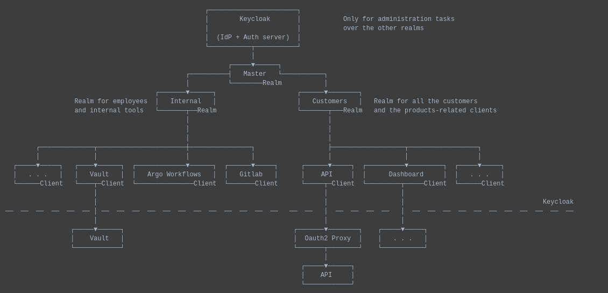

# Security Model

## Motivation

> One of the major security risk for all systems is not located on the source code itself but most times on the people
> who can access them.

## Diagram



## What is a realm

If you are a developer, you should know the concept of _tenancy_. In the basis, a realm is like a tenancy for Keycloak.
Each realm support its own users, its own clients and its own everything. There is only one limitation: as described in
the official documentation, even when the `master` realm can do everything, it should only be used to create and manage
secondary ones, where the actual life is happening.

For this reason, as you can see in the diagram on top of the page, we have a `master` realm where only administrators
can enter, and other secondary realms to solve the homogenization and security problems of the company:

- **Internal:** This realm is intended only for internal tools usage. Vault, Gitlab, etc, should be protected using clients
  of this realm. All employees are registered on this one.
- **Customers:** This realm has a clear purpose to store all the customers of the company. The clients of this realm must
  be the applications that access the customers' data

## What is a client

A client represents an application which needs to access user data, for example, getting a JWT. In the case of this
company, an example could be a dashboard. The dashboard gets JWTs for the signed-in users and use them to call the APIs.
Those JWTs have some personal user data about profile or permissions, so the dashboard should be considered as an application
which needs a Keycloak client.

If you still don't understand the concept, the key idea is that a client is like a challenge the application have to
perform to get some user data in the form of a JWT.

## Propper flow to generate a client

The problem about everyone managing the realms' clients is that, most times, they include credentials like the
client `id` or `secret`, and this could represent a security risk for a company.

One of the related tasks for infrastructure people is to reduce the exposed surface for key services like this one,
so we propose a flow to manage the clients in a safe way. which is represented in the following diagram:

### Flow for development

```text
    ┌────────────────────┐     ┌─────────────────────────────┐      ┌───────────────────────────┐
    │  Developers craft  ├─────►  Developers craft a client  ├──────►  Application uses the     │
    │  an application    │     │  on a development realm     │      │  credentials to be tested │
    └────────────────────┘     └─────────────────────────────┘      └───────────────────────────┘
```

### Flow for production

```text
    ┌────────────────────┐     ┌─────────────────────────────┐      ┌───────────────────────────┐
    │  Developers craft  ├─────►  Developers ask SRE member  ├──────►  Ops members evaluate     │
    │  an application    │     │  for a realm client         │      │  possible security risks  │
    └────────────────────┘     └─────────────────────────────┘      └────────────┬──────────────┘
                                                                                 │
                                                                                 │
    ┌────────────────────┐     ┌─────────────────────────────┐      ┌────────────▼──────────────┐
    │ Application uses   │     │ Ops store the credentials   │      │ Ops create a suitable     │
    │ the credentials    ◄─────┤ inside right path on Vault  ◄──────┤ client for the use case   │
    └────────────────────┘     └─────────────────────────────┘      └───────────────────────────┘
```

As you can see, SRE and developers working together, as DevOps philosophy dictates. Because remember, DevOps is NOT
a position but a mentality.
